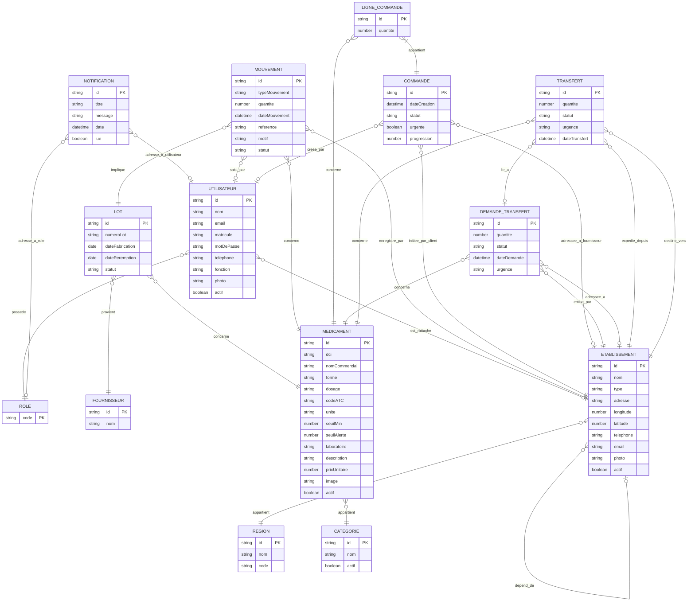

# Documentation du Système d'Information en Gestion Logistique (SIGL)

Ce document décrit les règles de gestion métier du système selon la méthode MERISE, respectant une définition strictement séquentielle (aucun concept n'est utilisé s'il n'a pas été défini dans une règle précédente), ainsi que le Modèle Conceptuel de Données (MCD) correspondant.

## 1. Règles de Gestion (Méthode MERISE)

* **RG01** : Un rôle est identifié de manière unique par un code (superviseur_national, pharmacien_region, pharmacien_pharmacie, agent_caisse, admin_central).
* **RG02** : Une région est identifiée par un identifiant unique, possède un nom obligatoire et peut posséder un code.
* **RG03** : Une catégorie thérapeutique est identifiée par un identifiant unique, possède un nom obligatoire et un état d'activation (actif ou inactif).
* **RG04** : Un fournisseur est identifié par un identifiant unique et possède un nom obligatoire.
* **RG05** : Un établissement est identifié par un identifiant unique, possède un nom obligatoire, un type strict (PHARMACIE, REGION, NATIONAL), une adresse, des coordonnées géographiques (longitude, latitude), un numéro de téléphone, une adresse email, une photo et un état d'activation.
* **RG06** : Un établissement appartient obligatoirement à une et une seule région.
* **RG07** : Une région peut contenir zéro, un ou plusieurs établissements.
* **RG08** : Un établissement peut dépendre hiérarchiquement de zéro ou un établissement parent.
* **RG09** : Un établissement peut superviser zéro, un ou plusieurs établissements enfants.
* **RG10** : Un utilisateur est identifié par un identifiant unique, possède un nom, une adresse email, un matricule, un mot de passe, un numéro de téléphone, une fonction, une photo et un état d'activation.
* **RG11** : Un utilisateur possède obligatoirement un et un seul rôle.
* **RG12** : Un rôle peut être attribué à zéro, un ou plusieurs utilisateurs.
* **RG13** : Un utilisateur est rattaché à zéro ou un établissement.
* **RG14** : Un établissement peut employer zéro, un ou plusieurs utilisateurs.
* **RG15** : Une notification est identifiée par un identifiant unique, possède un titre, un message, une date d'émission et un statut de lecture (lue ou non lue).
* **RG16** : Une notification peut être adressée à zéro ou un rôle spécifique.
* **RG17** : Une notification peut être adressée à zéro ou un utilisateur spécifique.
* **RG18** : Un médicament est identifié par un identifiant unique, possède une Dénomination Commune Internationale (DCI), un nom commercial, une forme galénique, un dosage, un code ATC, une unité de mesure, un seuil minimum, un seuil d'alerte, un laboratoire, une description, un prix unitaire, une image et un état d'activation.
* **RG19** : Un médicament appartient obligatoirement à une et une seule catégorie thérapeutique.
* **RG20** : Une catégorie thérapeutique peut classifier zéro, un ou plusieurs médicaments.
* **RG21** : Un lot est identifié par un identifiant unique, possède un numéro de lot, une date de fabrication, une date de péremption et un statut (actif, expire, rappel).
* **RG22** : Un lot concerne obligatoirement un et un seul médicament.
* **RG23** : Un médicament peut être stocké sous forme de zéro, un ou plusieurs lots.
* **RG24** : Un lot provient obligatoirement d'un et un seul fournisseur.
* **RG25** : Un fournisseur peut fournir zéro, un ou plusieurs lots.
* **RG26** : Un mouvement de stock est identifié par un identifiant unique, possède un type (ENTREE, SORTIE, DESTRUCTION, AJUSTEMENT), une quantité, une date de mouvement, une référence, un motif et un statut (en_attente, valide, rejete).
* **RG27** : Un mouvement de stock est enregistré obligatoirement par un et un seul établissement.
* **RG28** : Un établissement peut enregistrer zéro, un ou plusieurs mouvements de stock.
* **RG29** : Un mouvement de stock concerne obligatoirement un et un seul médicament.
* **RG30** : Un médicament peut être concerné par zéro, un ou plusieurs mouvements de stock.
* **RG31** : Un mouvement de stock implique obligatoirement un et un seul lot.
* **RG32** : Un lot peut être impliqué dans zéro, un ou plusieurs mouvements de stock.
* **RG33** : Un mouvement de stock est saisi par zéro ou un utilisateur (auteur).
* **RG34** : Un utilisateur peut saisir zéro, un ou plusieurs mouvements de stock.
* **RG35** : Une commande est identifiée par un identifiant unique, possède une date de création, un statut d'avancement, un indicateur d'urgence et un pourcentage de progression.
* **RG36** : Une commande est initiée (en tant que client) par obligatoirement un et un seul établissement.
* **RG37** : Un établissement peut initier zéro, une ou plusieurs commandes.
* **RG38** : Une commande est adressée (en tant que fournisseur) à zéro ou un établissement.
* **RG39** : Un établissement peut recevoir zéro, une ou plusieurs commandes.
* **RG40** : Une commande est créée par zéro ou un utilisateur (auteur).
* **RG41** : Un utilisateur peut créer zéro, une ou plusieurs commandes.
* **RG42** : Une ligne de commande est identifiée par un identifiant unique et possède une quantité commandée.
* **RG43** : Une ligne de commande appartient obligatoirement à une et une seule commande.
* **RG44** : Une commande contient au moins une ou plusieurs lignes de commande.
* **RG45** : Une ligne de commande concerne obligatoirement un et un seul médicament.
* **RG46** : Un médicament peut être concerné par zéro, une ou plusieurs lignes de commande.
* **RG47** : Une demande de transfert est identifiée par un identifiant unique, possède une quantité demandée, un statut, une date de demande et un niveau d'urgence.
* **RG48** : Une demande de transfert est émise par obligatoirement un et un seul établissement demandeur.
* **RG49** : Un établissement peut émettre zéro, une ou plusieurs demandes de transfert.
* **RG50** : Une demande de transfert est adressée à zéro ou un établissement cible spécifique.
* **RG51** : Un établissement peut recevoir zéro, une ou plusieurs demandes de transfert.
* **RG52** : Une demande de transfert concerne obligatoirement un et un seul médicament.
* **RG53** : Un médicament peut être concerné par zéro, une ou plusieurs demandes de transfert.
* **RG54** : Un transfert est identifié par un identifiant unique, possède une quantité transférée, un statut, un niveau d'urgence et une date de transfert.
* **RG55** : Un transfert expédie des produits depuis obligatoirement un et un seul établissement d'origine.
* **RG56** : Un établissement peut expédier zéro, un ou plusieurs transferts.
* **RG57** : Un transfert destine des produits vers obligatoirement un et un seul établissement de destination.
* **RG58** : Un établissement peut recevoir zéro, un ou plusieurs transferts.
* **RG59** : Un transfert concerne obligatoirement un et un seul médicament.
* **RG60** : Un médicament peut être concerné par zéro, un ou plusieurs transferts.
* **RG61** : Un transfert peut être lié à zéro ou une demande de transfert.
* **RG62** : Une demande de transfert peut générer zéro, un ou plusieurs transferts.

## 2. Modèle Conceptuel de Données (MCD)

Le schéma ci-dessous utilise la syntaxe **Mermaid.js** pour représenter le Modèle Entité-Association (ERD) en respectant les cardinalités MERISE (0,1 ; 1,1 ; 0,n ; 1,n).

